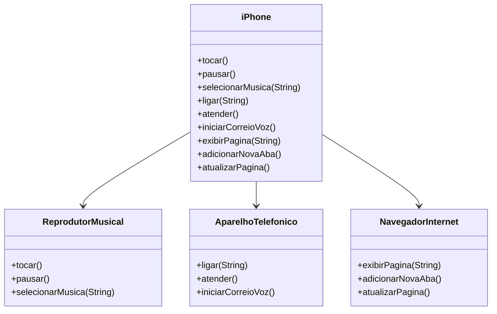

# Desafio POO - Modelagem iPhone

Implementação do desafio de Programação Orientada a Objetos da DIO, simulando as funcionalidades do iPhone (2007).

## Funcionalidades
- Reprodutor Musical
- Aparelho Telefônico
- Navegador Internet

## Diagrama UML

